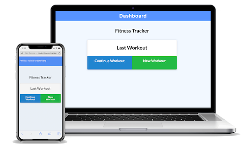
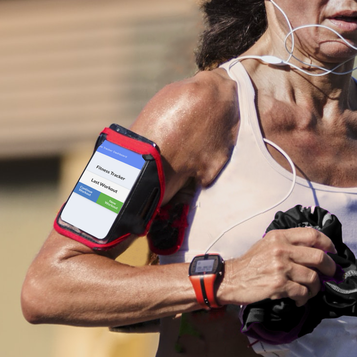

# Node Fitness Tracker
 
   ## [About](#about) &nbsp;&bull;&nbsp; [Description](#description) &nbsp;&bull;&nbsp; [Installation](#installation) &nbsp;&bull;&nbsp; [License](#license) &nbsp;&bull;&nbsp; [Heroku](#heroku) &nbsp;&bull;&nbsp; [GitHub](#gitHub)
  
## About

This fitness application allows users to view, create, and track their resistant workouts and cardio workouts. They can also track the name, type, weight, sets, reps, and duration for each exercise.

After the workout is completed, then use the dashboard to see the stats of your progress.

## Description

  

  

  

## Installation

This assignment will require you to create Mongo database with a Mongoose schema and handle routes with Express.
* Run `npm install`
* Run `mongodb`

## License

Photograph credits:
* picture 1: by [walt ribeiro](http://waltrib.com)
* picture 2: by [raeng](https://unsplash.com/photos/E-HKcFWMM34)
* picture 3: by [quino al](https://unsplash.com/photos/iRt9yOWzfOk)
* picture 4: by [william hook](https://unsplash.com/photos/9e9PD9blAto)

## Heroku
https://node-fitness-tracker.herokuapp.com/

## GitHub
https://github.com/waltribeiro/node-fitness-tracker
